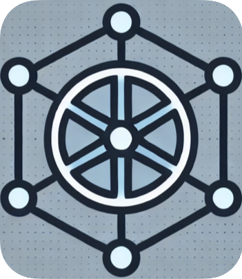

<p align="center"><a href="https://github.com/NVIDIA/topograph" target="_blank"></a></p>

# Topograph


Topograph is a component designed to expose the underlying physical network topology of a cluster to enable a workload manager make network-topology aware scheduling decisions.

Topograph consists of four major components:

1. **API Server**
2. **Node Observer**
3. **CSP Connector**
4. **Topology Generator**

<p align="center"></p>

## Components

### 1. API Server
The API Server listens for network topology configuration requests on a specific port. When a request is received, the server triggers the Topology Generator to populate the configuration.

### 2. Node Observer
The Node Observer is used when the Topology Generator is deployed in a Kubernetes cluster. It monitors changes in the cluster nodes.
If a node's status changes (e.g., a node goes down or comes up), the Node Observer sends a request to the API Server to generate a new topology configuration.

### 3. CSP Connector
The CSP Connector is responsible for interfacing with various CSPs to retrieve cluster-related information. Currently, it supports AWS, OCI, GCP, CoreWeave, bare metal, with plans to add support for Azure. The primary goal of the CSP Connector is to obtain the network topology configuration of a cluster, which may require several subsequent API calls. Once the information is obtained, the CSP Connector translates the network topology from CSP-specific formats to an internal format that can be utilized by the Topology Generator.

### 4. Topology Generator
The Topology Generator is the central component that manages the overall network topology of the cluster. It performs the following functions:
- **Notification Handling:** Receives notifications from the API Server.
- **Topology Gathering:** Instructs the CSP Connector to fetch the current network topology from the CSP.
- **User Cluster Update:** Translates network topology from the internal format into a format expected by the user cluster, such as SLURM or Kubernetes.

## Workflow

- The API Server listens on the port and notifies the Topology Generator about incoming requests. In kubernetes, the incoming requests sent by the Node Observer, which watches changes in the node status.
- The Topology Generator receives the notification and attempts to gather the current network topology of the cluster.
- The Topology Generator instructs the CSP Connector to retrieve the network topology from the CSP.
- The CSP Connector fetches the topology and translates it from the CSP-specific format to an internal format.
- The Topology Generator converts the internal format into the format expected by the user cluster (e.g., SLURM or Kubernetes).

## Configuration
Topograph accepts its configuration file path using the `-c` command-line parameter. The configuration file is a YAML document. A sample configuration file is located at [config/topograph-config.yaml](config/topograph-config.yaml).

The configuration file supports the following parameters:
```yaml
# serving topograph endpoint
http:
  # port: specifies the port on which the API server will listen (required).
  port: 49021
  # ssl: enables HTTPS protocol if set to `true` (optional).
  ssl: false

# provider: the provider that topograph will use (optional)
# Valid options include "aws", "oci", "gcp", "cw", "baremetal" or "test".
# Can be overridden if the provider is specified in a topology request to topograph
provider: "aws"

# engine: the engine that topograph will use (optional)
# Valid options include "slurm", "k8s", or "test".
# Can be overridden if the engine is specified in a topology request to topograph
engine: "slurm"

# request_aggregation_delay: defines the delay before processing a request (required).
# Topograph aggregates multiple sequential requests within this delay into a single request,
# processing only if no new requests arrive during the specified duration.
request_aggregation_delay: 15s

# forward_service_url: specifies the URL of an external gRPC service
# to which requests are forwarded (optional).
# This can be useful for testing or integration with external systems.
# See protos/topology.proto for details.
# forward_service_url:

# page_size: sets the page size for topology requests against a CSP API (optional).
page_size: 100

# ssl: specifies the paths to the TLS certificate, private key,
# and CA certificate (required if `http.ssl=true`).
ssl:
  cert: /etc/topograph/ssl/server-cert.pem
  key: /etc/topograph/ssl/server-key.pem
  ca_cert: /etc/topograph/ssl/ca-cert.pem

# credentials_path: specifies the path to a file containing CSP credentials (optional).
# credentials_path:

# env: environment variable names and values to inject into Topograph's shell (optional).
# The `PATH` variable, if provided, will append the specified value to the existing `PATH`.
env:
#  SLURM_CONF: /etc/slurm/slurm.conf
#  PATH: 
```

## Supported Environments

Topograph operates with two primary concepts: `provider` and `engine`. A `provider` represents a CSP or a similar environment, while an engine refers to a scheduling system like SLURM or Kubernetes.

Currently supported providers:
- AWS
- OCI
- GCP
- CoreWeave
- Bare metal

For detailed information on supported engines, see:
- [SLURM](./docs/slurm.md)
- [Kubernetes](./docs/k8s.md)

## Using Topograph

Topograph offers three endpoints for interacting with the service. Below are the details of each endpoint:

### 1. Health Endpoint

- **URL:** `http://<server>:<port>/healthz`
- **Description:** This endpoint verifies the service status. It returns a "200 OK" HTTP response if the service is operational.

### 2. Topology Request Endpoint

- **URL:** `http://<server>:<port>/v1/generate`
- **Description:** This endpoint is used to request a new cluster topology.
- **Payload:** The payload is a JSON object that includes the following fields:
  - **provider name**: (optional) A string specifying the Service Provider, such as `aws`, `oci`, `gcp`, `cw`, `baremetal` or `test`. This parameter will be override the provider set in the topograph config.
  - **provider credentials**: (optional) A key-value map with provider-specific parameters for authentication.
  - **provider parameters**: (optional) A key-value map with parameters that are used for provider simulation with toposim.
    - **model_path**: (optional) A string parameter that points to the model file to use for simulating topology.
  - **engine name**: (optional) A string specifying the topology output, either `slurm`, `k8s`, or `test`. This parameter will override the engine set in the topograph config.
  - **engine parameters**: (optional) A key-value map with engine-specific parameters.
    - **slurm parameters**:
      - **topology_config_path**: (optional) A string specifying the file path for the topology configuration. If omitted, the topology config content is returned in the HTTP response.
      - **plugin**: (optional) A string specifying topology plugin. Default topology/tree.
      - **block_sizes**: (optional) A string specifying block size for topology/block plugin
      - **skip_reload**: (optional) If present, the cluster reconfiguration is skipped.
    - **k8s parameters**:
      - **topology_config_path**: (mandatory) A string specifying the key for the topology config in the ConfigMap.
      - **topology_configmap_name**: (mandatory) A string specifying the name of the ConfigMap containing the topology config.
      - **topology_configmap_namespace**: (mandatory) A string specifying the namespace of the ConfigMap containing the topology config.
  - **nodes**: (optional) An array of regions mapping instance IDs to node names.

  Example:

```json
  {
  "provider": {
    "name": "aws",
    "creds": {
      "access_key_id": "id",
      "secret_access_key": "secret"
    },
    "params": {
      "model_path": ""
    }
  },
  "engine": {
    "name": "slurm",
    "params": {
      "plugin": "topology/block",
      "block_sizes": "30,120"
    }
  },
  "nodes": [
    {
      "region": "region1",
      "instances": {
        "instance1": "node1",
        "instance2": "node2",
        "instance3": "node3"
      }
    },
    {
      "region": "region2",
      "instances": {
        "instance4": "node4",
        "instance5": "node5",
        "instance6": "node6"
      }
    }
  ]
}
```

- **Response:** This endpoint immediately returns a "202 Accepted" status with a unique request ID if the request is valid. If not, it returns an appropriate error code.

### 3. Topology Result Endpoint

- **URL:** `http://<server>:<port>/v1/topology`
- **Description:** This endpoint retrieves the result of a topology request.
- **URL Query Parameters:**
  - **uid**: Specifies the request ID returned by the topology request endpoint.
- **Response:** Depending on the request's execution stage, this endpoint can return:
  - "404 NotFound" if the configuration is not ready yet.
  - "200 OK" if the request has been completed successfully.
  - "500 InternalServerError" if there was an error during request execution.

Example usage:

```bash
id=$(curl -s -X POST -H "Content-Type: application/json" -d @payload.json http://localhost:49021/v1/generate)

curl -s "http://localhost:49021/v1/topology?uid=$id"
```
