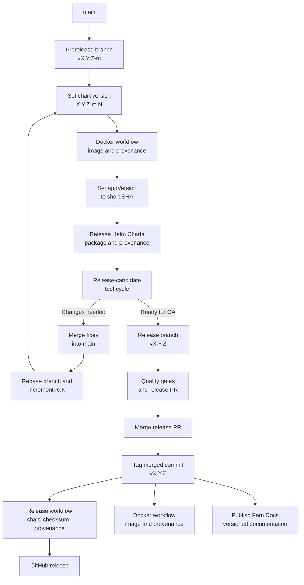

# Release Process

This document outlines the release process for Topograph.

## Release cadence and responsibility

Topograph targets one minor release per calendar quarter. The cadence is
time-based: work that is not ready for a scheduled release moves to a later
release rather than delaying the release solely to include it.

For each release, the active maintainers nominate one active maintainer to
serve as the release person. The nomination should be recorded in the release
tracking issue or another public project record before publication begins.

Only the nominated release person may initiate that release by running the
publication workflows and publishing the GitHub release. If the release person
cannot complete the release, the maintainers nominate a replacement before
another person initiates it.

The active maintainer roster is maintained in [MAINTAINERS.md](./MAINTAINERS.md),
and maintainer release authority is defined in [GOVERNANCE.md](./GOVERNANCE.md).

## Prerequisites

- Nomination as the release person for the release
- Repository write access, including access to GitHub Actions and GitHub Releases
- Understanding of semantic versioning (`vMAJOR.MINOR.PATCH`)
- A clean release commit with all required CI checks passing

## Version management

- Official versions use `vX.Y.Z`, where `X`, `Y`, and `Z` are the major,
  minor, and patch versions.
- Each official release branch uses the canonical version as its complete name,
  such as `v1.2.0`. Do not add a `release/` or other prefix.
- The Git tag and GitHub release use the same canonical version as the release
  branch.
- The Helm chart `version` omits the `v` prefix, while `appVersion` includes it.
  For example, release `v1.2.0` uses `version: "1.2.0"` and
  `appVersion: "v1.2.0"`.
- Release candidates use one prerelease branch for the release series, such as
  `v1.2.0-rc`, and increment the candidate suffix in the Helm chart version,
  such as `1.2.0-rc.1` and `1.2.0-rc.2`.

## Release procedure

### Prerelease cycle

Use one prerelease branch for all release candidates in a given release cycle.

1. Create a branch named for the release-candidate series, such as
   `v1.2.0-rc`.

2. In `charts/topograph/Chart.yaml`, set `version` to the release-candidate
   version. Omit the `v` prefix and include the candidate number, such as
   `1.2.0-rc.1`. Leave `appVersion` unchanged for now.

   Commit the change and push the prerelease branch. Do not create a pull
   request for this branch; it is used only to build and test release
   candidates and will not be merged.

3. In GitHub, run the **Docker** workflow against the prerelease branch. The
   workflow publishes the Topograph container image with two tags: the branch
   name, such as `v1.2.0-rc`, and the short commit SHA. It also generates signed
   SLSA provenance for the image and publishes it to GHCR.

4. Set `appVersion` in `charts/topograph/Chart.yaml` to the short commit SHA
   produced in the previous step. Commit and push the change to the prerelease
   branch.

5. Run the **Release Helm Charts** workflow against the prerelease branch. The
   workflow publishes the chart package to the Topograph Helm repository. For
   example, version `1.2.0-rc.1` is published as:

   `https://nvidia.github.io/topograph/topograph-1.2.0-rc.1.tgz`

   The workflow also publishes
   `topograph-1.2.0-rc.1.tgz.sha256` beside the chart package and generates
   signed SLSA provenance for the chart package.

6. Run the release-candidate test cycle.

   If testing reveals that code changes are needed, make them in separate
   feature or fix branches and merge them into `main`. When the changes for the
   next release candidate are ready, rebase the prerelease branch onto `main`,
   increment the candidate number in `Chart.yaml` (for example, from
   `1.2.0-rc.1` to `1.2.0-rc.2`), and repeat steps 2 through 6.

### Official release

When the release is ready for general availability, follow these steps:

1. Create a release branch from `main` using the canonical version name:

   ```bash
   git checkout main
   git pull origin main
   git checkout -b v1.2.0
   ```

2. Update `charts/topograph/Chart.yaml`:

   - Set `version` to the release version without the `v` prefix, such as
     `1.2.0`.
   - Set `appVersion` to the canonical release version, such as `v1.2.0`.

3. Prepare `CHANGELOG.md`:

   - Consolidate the relevant entries and remove redundant intermediate
     entries.
   - Move the released changes from **Unreleased** to a section named
     `## [1.2.0] - YYYY-MM-DD`.
   - Keep an empty **Unreleased** section for future changes.
   - Add or update the comparison link for the release.

4. Run the [quality gates](#quality-gates), commit the changes with DCO
   sign-off, push the branch, and create a pull request.

5. Merge the release pull request. Do not publish release artifacts from the
   release branch; the canonical tag must identify the exact source commit used
   to build them.

6. Update local `main`, record the release pull request's merge commit, verify
   that it is on `main`, then create and push an annotated tag that targets that
   exact commit. Replace `123` with the release pull request number and inspect
   the displayed commit before pushing the tag:

   ```bash
   git checkout main
   git pull --ff-only origin main
   RELEASE_PR=123
   RELEASE_COMMIT=$(gh pr view "${RELEASE_PR}" --json mergeCommit --jq '.mergeCommit.oid')
   if ! git merge-base --is-ancestor "${RELEASE_COMMIT}" origin/main; then
     echo "Release commit is not reachable from origin/main." >&2
     exit 1
   fi
   git show --no-patch --oneline "${RELEASE_COMMIT}"
   git tag -a v1.2.0 "${RELEASE_COMMIT}" -m "Release v1.2.0"
   git push origin v1.2.0
   ```

7. The tag push automatically starts these workflows:

   - **Release** packages and attests the Helm chart, generates and verifies its
     SHA-256 checksum, publishes both files to the Helm repository, and creates
     the GitHub release with both files attached.
   - **Docker** publishes the multi-architecture container image and its signed
     SLSA provenance.
   - **Publish Fern Docs** publishes the versioned documentation.

8. Complete the [release verification](#release-verification) after all three
   workflows finish successfully.

## Workflow pipeline



The nominated release person manually dispatches **Docker** and **Release Helm
Charts** for release candidates. Pushing an official `vX.Y.Z` tag triggers the
official **Release**, **Docker**, and **Publish Fern Docs** workflows.

## Released components

An official release publishes:

- A multi-architecture Topograph container image at
  `ghcr.io/nvidia/topograph:vX.Y.Z`
- A Helm chart in the Topograph chart repository at
  `https://nvidia.github.io/topograph`
- A SHA-256 checksum published beside the Helm chart package
- A GitHub release and source tag named `vX.Y.Z`, with the Helm chart and its
  checksum attached
- Versioned documentation generated from the release tag
- Signed SLSA build provenance for the container image and Helm chart package

## Quality gates

All releases must pass:

- Formatting, vet, lint, and Go tests through `make qualify`
- Helm lint and chart tests through `make chart-test`
- Required GitHub CI checks on the release pull request
- Review of `CHANGELOG.md` for complete, user-facing release notes
- DCO sign-off verification for every commit
- Successful SLSA provenance generation for every published artifact

## Release verification

Verify the published container image:

```bash
docker buildx imagetools inspect ghcr.io/nvidia/topograph:v1.2.0
```

Verify the published Helm chart:

```bash
helm repo add topograph https://nvidia.github.io/topograph
helm repo update
helm show chart topograph/topograph --version 1.2.0
```

Verify the container image's SLSA provenance:

```bash
gh attestation verify oci://ghcr.io/nvidia/topograph:v1.2.0 \
  --repo NVIDIA/topograph \
  --signer-workflow NVIDIA/topograph/.github/workflows/docker.yml \
  --source-ref refs/tags/v1.2.0
```

Download the Helm chart and verify its SLSA provenance:

```bash
curl -fsSLO https://nvidia.github.io/topograph/topograph-1.2.0.tgz
curl -fsSLO https://nvidia.github.io/topograph/topograph-1.2.0.tgz.sha256
sha256sum --check topograph-1.2.0.tgz.sha256
gh attestation verify topograph-1.2.0.tgz \
  --repo NVIDIA/topograph \
  --signer-workflow NVIDIA/topograph/.github/workflows/release.yml \
  --source-ref refs/tags/v1.2.0
```

Also confirm that:

- The [GitHub release](https://github.com/NVIDIA/topograph/releases) has the
  correct tag, release notes, Helm chart, and checksum.
- The **Docker**, **Release**, and **Publish Fern Docs** workflow
  runs completed successfully.
- The published chart references the expected container image tag.

## Troubleshooting

### Failed container or Helm publication

- Review the failed workflow's logs in GitHub Actions.
- Correct code or configuration through a reviewed pull request to `main`.
- Do not move or replace an existing release tag. If the release itself must be
  corrected, prepare a new patch release.
- To retry the **Release** workflow without changing its provenance context,
  dispatch it from the existing tag:

  ```bash
  gh workflow run release.yml --ref v1.2.0 -f tag=v1.2.0
  ```

- To retry the **Docker** workflow, dispatch it from the same existing tag:

  ```bash
  gh workflow run docker.yml --ref v1.2.0
  ```

### Failed documentation publication

- Review the **Publish Fern Docs** workflow logs.
- Confirm that the tag exists and matches `vX.Y.Z`.
- After correcting the failure, manually dispatch **Publish Fern Docs** with
  the existing tag. Do not create a replacement tag solely to retry the docs
  publication.

### Failed provenance generation

- Review the **Generate SLSA provenance** step in the publishing workflow.
- For container provenance, confirm that the Docker job grants the following:
  `packages: write`, `id-token: write`, `attestations: write`, and
  `artifact-metadata: write`.
- For Helm provenance, confirm that the Helm job grants `id-token: write` and
  `attestations: write`. It does not need `artifact-metadata: write` because the
  chart attestation is stored by GitHub rather than pushed to an OCI registry.
- Retry the failed publishing workflow from the same tag. For **Release**, use
  the tag-bound manual dispatch command shown above so the new attestation still
  names `refs/tags/v1.2.0` as its source.
