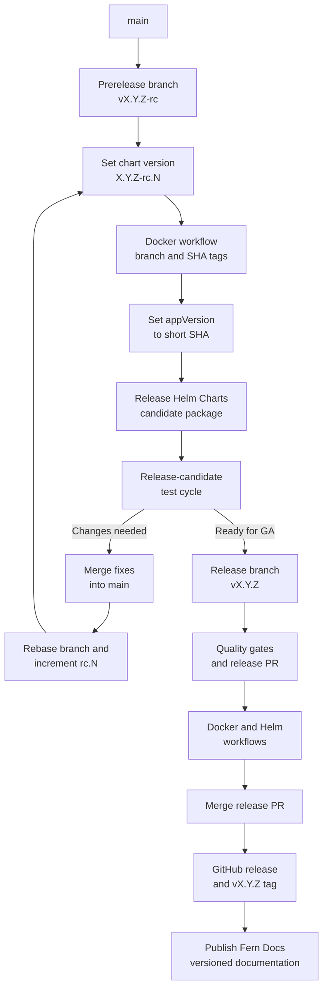

# Release Process

This document outlines the release process for Topograph.

## Release cadence and responsibility

Topograph targets one minor release per calendar quarter. The cadence is
time-based: work that is not ready for a scheduled release moves to a later
release rather than delaying the release solely to include it.

For each release, the active maintainers nominate one active maintainer to
serve as the release person. The nomination should be recorded in the release
tracking issue or another public project record before publication begins.

Only the nominated release person may initiate that release by running the
publication workflows and publishing the GitHub release. If the release person
cannot complete the release, the maintainers nominate a replacement before
another person initiates it.

The active maintainer roster is maintained in [MAINTAINERS.md](./MAINTAINERS.md),
and maintainer release authority is defined in [GOVERNANCE.md](./GOVERNANCE.md).

## Prerequisites

- Nomination as the release person for the release
- Repository write access, including access to GitHub Actions and GitHub Releases
- Understanding of semantic versioning (`vMAJOR.MINOR.PATCH`)
- A clean release commit with all required CI checks passing

## Version management

- Official versions use `vX.Y.Z`, where `X`, `Y`, and `Z` are the major,
  minor, and patch versions.
- Each official release branch uses the canonical version as its complete name,
  such as `v1.2.0`. Do not add a `release/` or other prefix.
- The Git tag and GitHub release use the same canonical version as the release
  branch.
- The Helm chart `version` omits the `v` prefix, while `appVersion` includes it.
  For example, release `v1.2.0` uses `version: "1.2.0"` and
  `appVersion: "v1.2.0"`.
- Release candidates use one prerelease branch for the release series, such as
  `v1.2.0-rc`, and increment the candidate suffix in the Helm chart version,
  such as `1.2.0-rc.1` and `1.2.0-rc.2`.

## Release procedure

### Prerelease cycle

Use one prerelease branch for all release candidates in a given release cycle.

1. Create a branch named for the release-candidate series, such as
   `v1.2.0-rc`.

2. In `charts/topograph/Chart.yaml`, set `version` to the release-candidate
   version. Omit the `v` prefix and include the candidate number, such as
   `1.2.0-rc.1`. Leave `appVersion` unchanged for now.

   Commit the change and push the prerelease branch. Do not create a pull
   request for this branch; it is used only to build and test release
   candidates and will not be merged.

3. In GitHub, run the **Docker** workflow against the prerelease branch. The
   workflow publishes the Topograph container image with two tags: the branch
   name, such as `v1.2.0-rc`, and the short commit SHA.

4. Set `appVersion` in `charts/topograph/Chart.yaml` to the short commit SHA
   produced in the previous step. Commit and push the change to the prerelease
   branch.

5. Run the **Release Helm Charts** workflow against the prerelease branch. The
   workflow publishes the chart package to the Topograph Helm repository. For
   example, version `1.2.0-rc.1` is published as:

   `https://nvidia.github.io/topograph/topograph-1.2.0-rc.1.tgz`

6. Run the release-candidate test cycle.

   If testing reveals that code changes are needed, make them in separate
   feature or fix branches and merge them into `main`. When the changes for the
   next release candidate are ready, rebase the prerelease branch onto `main`,
   increment the candidate number in `Chart.yaml` (for example, from
   `1.2.0-rc.1` to `1.2.0-rc.2`), and repeat steps 2 through 6.

### Official release

When the release is ready for general availability, follow these steps:

1. Create a release branch from `main` using the canonical version name:

   ```bash
   git checkout main
   git pull origin main
   git checkout -b v1.2.0
   ```

2. Update `charts/topograph/Chart.yaml`:

   - Set `version` to the release version without the `v` prefix, such as
     `1.2.0`.
   - Set `appVersion` to the canonical release version, such as `v1.2.0`.

3. Prepare `CHANGELOG.md`:

   - Consolidate the relevant entries and remove redundant intermediate
     entries.
   - Move the released changes from **Unreleased** to a section named
     `## [1.2.0] - YYYY-MM-DD`.
   - Keep an empty **Unreleased** section for future changes.
   - Add or update the comparison link for the release.

4. Run the [quality gates](#quality-gates), commit the changes with DCO
   sign-off, push the branch, and create a pull request. Do not merge it yet.

5. In GitHub Actions, run these workflows against the release branch:

   1. **Docker**
   2. **Release Helm Charts**

   Confirm that the container image and Helm chart were published successfully.

6. Merge the release pull request.

7. On the [Topograph releases page](https://github.com/NVIDIA/topograph/releases),
   draft and publish a release with the canonical version as both the tag and
   release name, such as `v1.2.0`. Include the release notes from
   `CHANGELOG.md`.

## Workflow pipeline



The **Docker** and **Release Helm Charts** workflows are manually dispatched by
the nominated release person. Creating the release tag triggers the **Publish
Fern Docs** workflow automatically.

## Released components

An official release publishes:

- A multi-architecture Topograph container image at
  `ghcr.io/nvidia/topograph:vX.Y.Z`
- A Helm chart in the Topograph chart repository at
  `https://nvidia.github.io/topograph`
- A GitHub release and source tag named `vX.Y.Z`
- Versioned documentation generated from the release tag

## Quality gates

All releases must pass:

- Formatting, vet, lint, and Go tests through `make qualify`
- Helm lint and chart tests through `make chart-test`
- Required GitHub CI checks on the release pull request
- Review of `CHANGELOG.md` for complete, user-facing release notes
- DCO sign-off verification for every commit

## Release verification

Verify the published container image:

```bash
docker buildx imagetools inspect ghcr.io/nvidia/topograph:v1.2.0
```

Verify the published Helm chart:

```bash
helm repo add topograph https://nvidia.github.io/topograph
helm repo update
helm show chart topograph/topograph --version 1.2.0
```

Also confirm that:

- The [GitHub release](https://github.com/NVIDIA/topograph/releases) has the
  correct tag and release notes.
- The **Docker**, **Release Helm Charts**, and **Publish Fern Docs** workflow
  runs completed successfully.
- The published chart references the expected container image tag.

## Troubleshooting

### Failed container or Helm publication

- Review the failed workflow's logs in GitHub Actions.
- Correct code or configuration through a reviewed pull request to `main`.
- Update the release branch from `main`, rerun the quality gates, and retry the
  failed workflow against the same release branch.
- Do not publish the GitHub release until both the container image and Helm
  chart have been verified.

### Failed documentation publication

- Review the **Publish Fern Docs** workflow logs.
- Confirm that the tag exists and matches `vX.Y.Z`.
- After correcting the failure, manually dispatch **Publish Fern Docs** with
  the existing tag. Do not create a replacement tag solely to retry the docs
  publication.
