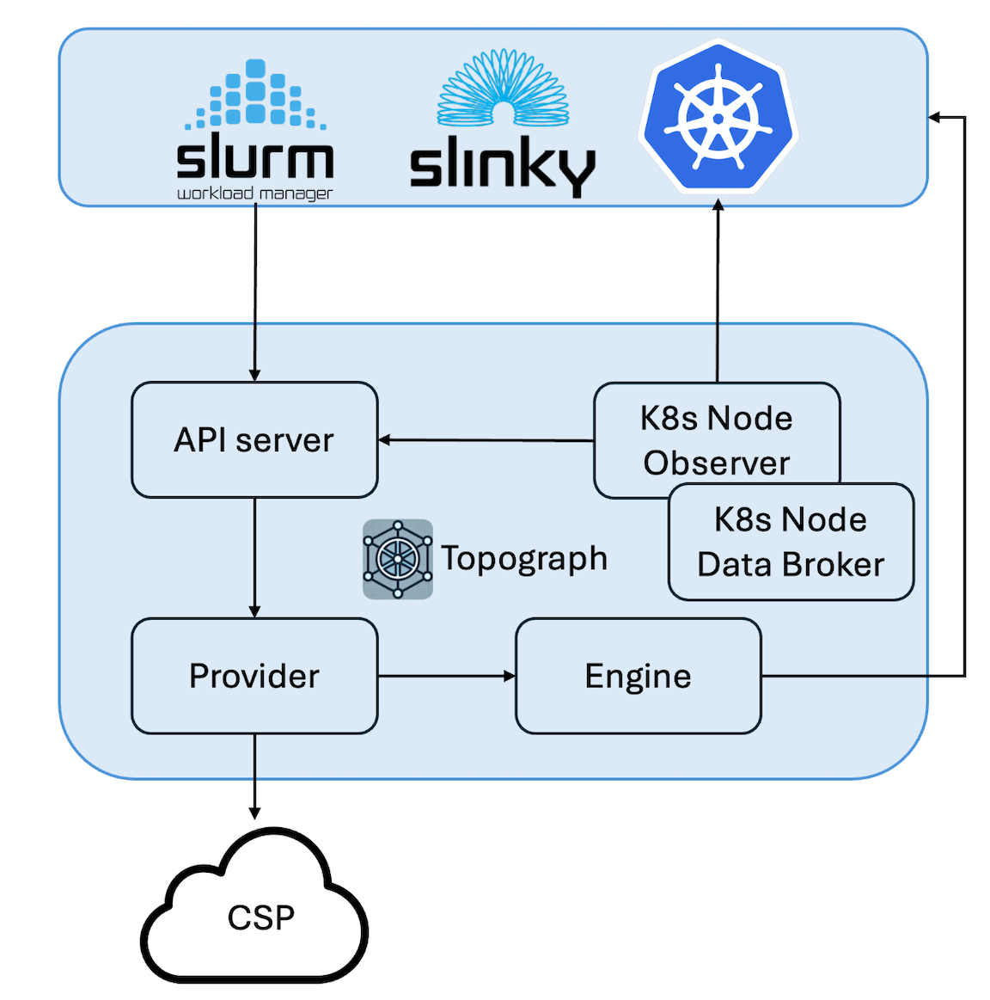

# Architecture

Topograph consists of five major components:

1. **API Server**
2. **Node Observer**
3. **Node Data Broker**
4. **Provider**
5. **Engine**

## Components

### 1. API Server

The API Server receives topology generation requests and returns results asynchronously. Requests are aggregated over a configurable delay window so that a burst of node changes (common during cluster scaling events) produces a single topology update rather than a storm.

### 2. Node Observer

The Node Observer is used in Kubernetes deployments. It monitors changes to cluster nodes. If a node goes down or comes online, the Node Observer sends a request to the API Server to generate a new topology configuration.

### 3. Node Data Broker

The Node Data Broker is also used when Topograph is deployed in a Kubernetes cluster. It collects relevant node attributes and stores them as node annotations.

### 4. Provider

The Provider interfaces with CSPs or on-premises tools to retrieve topology-related data from the cluster and converts it into an internal representation.

### 5. Engine

The Engine translates this internal representation into the format expected by the workload manager.

## Workflow

- The API Server listens on the port and notifies the Provider about incoming requests. In Kubernetes, the incoming requests are sent by the Node Observer, which watches changes in the node status.
- The Provider receives notifications and invokes CSP API to retrieve topology-related information.
- The Engine converts the topology information into the format expected by the user cluster (e.g., SLURM or Kubernetes).
