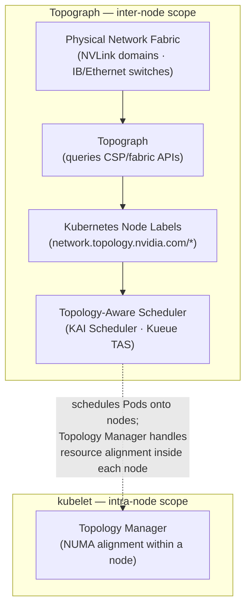

# Topograph in Kubernetes

Topograph is a tool designed to enhance scheduling decisions in Kubernetes clusters by leveraging network topology information.

## Overview

Topograph maps both the multi-tier network hierarchy and accelerated network domains (such as NVLink) using node labels.
Most cloud providers expose three levels of network topology through their APIs. To provide a unified view, Topograph assigns four labels to each node:
* `network.topology.nvidia.com/accelerator`: Identifies high-speed interconnect domains, such as NVLink.
* `network.topology.nvidia.com/leaf`: Indicates the switches directly connected to compute nodes.
* `network.topology.nvidia.com/spine`: Represents the next tier of switches above the leaf level.
* `network.topology.nvidia.com/core`: Denotes the top-level switches.

The names of these node labels are configurable via the [Helm chart](https://github.com/NVIDIA/topograph/tree/main/charts/topograph).

For example, if a node belongs to NVLink domain `nvl1` and connects to switch `s1`, which connects to switch `s2`, and then to switch `s3`, Topograph will apply the following labels to the node:

```
  network.topology.nvidia.com/accelerator: nvl1
  network.topology.nvidia.com/leaf: s1
  network.topology.nvidia.com/spine: s2
  network.topology.nvidia.com/core: s3
```

<p align="center"></p>

### Relationship to the kubelet Topology Manager

Kubernetes includes a [Topology Manager](https://kubernetes.io/docs/tasks/administer-cluster/topology-manager/) (GA since Kubernetes 1.27) that aligns CPU, GPU, and NIC allocations to the same NUMA domain *within a single node*, reducing memory access latency for a Pod's containers. These two features are complementary and address different scopes:

| | Topograph (`k8s` engine) | kubelet Topology Manager |
|---|---|---|
| **Scope** | Inter-node (cluster-wide) | Intra-node (single node) |
| **What it does** | Discovers the physical network fabric and publishes it as node labels | Aligns CPU/device allocations to the same NUMA domain within a node |
| **Consumed by** | Topology-aware schedulers (KAI Scheduler, Kueue TAS) for multi-node placement | The kubelet itself, when binding containers to hardware resources |

Both can be active simultaneously. Topology Manager optimizes resource allocation within a node; Topograph labels tell the scheduler which nodes belong together on the network.



## Use of Topograph

While there is currently no fully network-aware scheduler capable of optimally placing groups of pods based on network considerations, Topograph serves as a stepping stone toward developing such a scheduler.

Topograph can be used in conjunction with Kubernetes' existing PodAffinity feature.
This combination enhances pod distribution based on network topology information.

The following excerpt describes a Kubernetes object specification for a cluster with a three-tier network switch hierarchy. The goal is to improve inter-pod communication by assigning pods to nodes within
closer network proximity.

```yaml
    affinity:
      podAffinity:
        preferredDuringSchedulingIgnoredDuringExecution:
          - weight: 70
            podAffinityTerm:
              labelSelector:
                matchExpressions:
                  - key: app
                    operator: In
                    values:
                      - myapp
              topologyKey: network.topology.nvidia.com/spine
          - weight: 90
            podAffinityTerm:
              labelSelector:
                matchExpressions:
                  - key: app
                    operator: In
                    values:
                      - myapp
              topologyKey: network.topology.nvidia.com/leaf
```
Pods are prioritized to be placed on nodes sharing the label `network.topology.nvidia.com/leaf`.
These nodes are connected to the same network switch, ensuring the lowest latency for communication.

Nodes with the label `network.topology.nvidia.com/spine` are next in priority.
Pods on these nodes will still be relatively close, but with slightly higher latency.

In the three-tier network, all nodes will share the same `network.topology.nvidia.com/core` label,
so it doesn’t need to be included in pod affinity settings.

Since the default Kubernetes scheduler places one pod at a time, the placement may vary depending on where
the first pod is placed. As a result, each scheduling decision might not be globally optimal.
However, by aligning pod placement with network-aware labels, we can significantly improve inter-pod
communication efficiency within the limitations of the scheduler.

## Configuration
Topograph is deployed as a standard Kubernetes application using a [Helm chart](https://github.com/NVIDIA/topograph/tree/main/charts/topograph).
Topograph is configured using a configuration file stored in a ConfigMap and mounted to the Topograph container at `/etc/topograph/topograph-config.yaml`.
In addition, when sending a topology request, the request payload includes additional parameters.
The parameters for the configuration file and topology request are defined in the `global` section of the Helm values file, as shown below:

```yaml
global:
  # provider – name of the cloud provider or on-prem environment.
  # Supported values: "aws", "gcp", "oci", "nebius", "netq", "infiniband-k8s".
  provider: "aws"

  engine: "k8s"
```

## Exposing the Topograph API

The Topograph API server listens on port `49021` by default. The Helm chart always creates a Kubernetes `Service`; how that Service is exposed depends on your deployment topology and access requirements.

**The API server does not implement built-in authentication.** Access controls are always applied at a network layer (`NetworkPolicy`, service mesh, ingress auth, etc.). Deployments that expose the API outside the cluster must add an authentication layer in front of it.

### Access pattern matrix

| Pattern | When to use | Auth story |
|---|---|---|
| `ClusterIP` + `kubectl port-forward` (default) | Local debugging, one-off calls | kubeconfig-based — the user needs K8s API access |
| `ClusterIP` + in-cluster callers | Node Observer calling the API server; downstream schedulers consume node labels directly (no API call needed) | Cluster-internal; lock down with `NetworkPolicy` |
| `NodePort` / `LoadBalancer` | External access without Ingress — simple, but lacks hostname routing and TLS without extra setup | Expect to add an L7 auth layer in front |
| Traditional `Ingress` (`networking.k8s.io/v1`) | Most common production pattern — works with nginx-ingress, Traefik, cloud-managed ingress | Add via ingress auth annotations, oauth2-proxy, or mesh |

Gateway API (`HTTPRoute`) support is not yet implemented in the chart — follow the repository issues for status.

### Default: ClusterIP

By default, `global.service.type: ClusterIP` and `ingress.enabled: false`. This means:

- The API is not exposed outside the cluster
- In-cluster components (Node Observer, Node Data Broker) reach the API via the Service DNS name `<release>.<namespace>.svc.cluster.local:49021`
- Cluster operators can reach the API via port-forward for debugging:

```bash
kubectl -n <namespace> port-forward svc/topograph 49021:49021
curl http://localhost:49021/healthz
```

This is the recommended pattern for production deployments where Topograph is consumed only by in-cluster callers.

### Exposing via Ingress

Enable the bundled Ingress template:

```yaml
# values.yaml
ingress:
  enabled: true
  className: nginx
  hosts:
    - host: topograph.example.com
      paths:
        - path: /
          pathType: Prefix
  tls:
    - hosts:
        - topograph.example.com
      secretName: topograph-tls
```

Authentication must be added at the Ingress or mesh layer. Common patterns:

- nginx-ingress `nginx.ingress.kubernetes.io/auth-url` + oauth2-proxy
- Istio `RequestAuthentication` + `AuthorizationPolicy`
- mTLS termination at the ingress with client certificate validation

### Metrics endpoint

The `/metrics` endpoint exposes Prometheus metrics on the same port. Enable the bundled `ServiceMonitor` for Prometheus Operator scraping:

```yaml
serviceMonitor:
  enabled: true
```

This creates a `monitoring.coreos.com/v1` `ServiceMonitor` selecting the Topograph Service.

### NetworkPolicy

The chart does not ship a `NetworkPolicy` template at this time. For clusters that enforce NetworkPolicy, a recommended starting point allows ingress to port `49021` only from the Topograph namespace and from the Prometheus scraper namespace (when `serviceMonitor.enabled: true`), and denies all other ingress:

```yaml
apiVersion: networking.k8s.io/v1
kind: NetworkPolicy
metadata:
  name: topograph
  namespace: topograph
spec:
  podSelector:
    matchLabels:
      app.kubernetes.io/name: topograph
  policyTypes: [Ingress]
  ingress:
    - from:
        - namespaceSelector:
            matchLabels:
              kubernetes.io/metadata.name: topograph
      ports:
        - protocol: TCP
          port: 49021
    - from:
        - namespaceSelector:
            matchLabels:
              kubernetes.io/metadata.name: monitoring
      ports:
        - protocol: TCP
          port: 49021
```

Apply alongside the chart. A bundled template is under consideration.

## Validation and Testing
TBD
