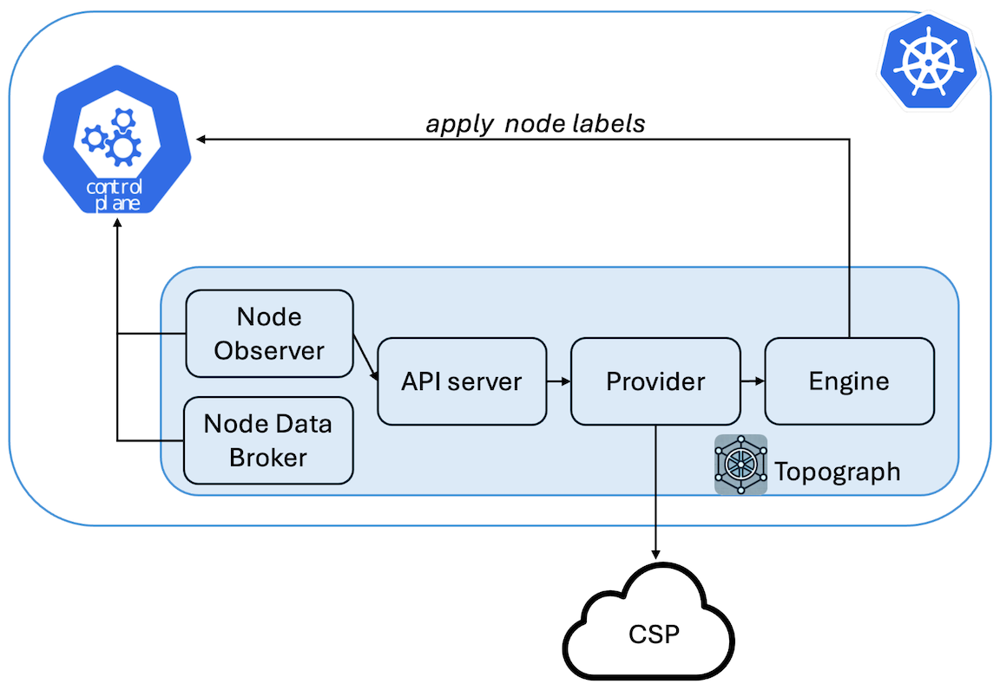
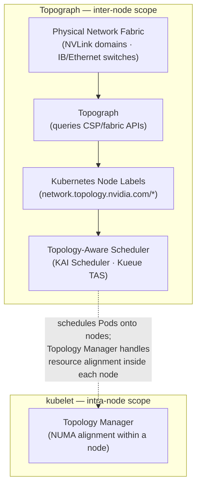

# Topograph in Kubernetes

Topograph is a tool designed to enhance scheduling decisions in Kubernetes clusters by leveraging network topology information.

## Overview

Topograph maps both the multi-tier network hierarchy and accelerated network domains (such as NVLink) using node labels.
Most cloud providers expose three levels of network topology through their APIs. To provide a unified view, Topograph assigns four labels to each node:
* `network.topology.nvidia.com/accelerator`: Identifies high-speed interconnect domains, such as NVLink.
* `network.topology.nvidia.com/leaf`: Indicates the switches directly connected to compute nodes.
* `network.topology.nvidia.com/spine`: Represents the next tier of switches above the leaf level.
* `network.topology.nvidia.com/core`: Denotes the top-level switches.

The names of these node labels are configurable via the [Helm chart](https://github.com/NVIDIA/topograph/tree/main/charts/topograph).

For example, if a node belongs to NVLink domain `nvl1` and connects to switch `s1`, which connects to switch `s2`, and then to switch `s3`, Topograph will apply the following labels to the node:

```
  network.topology.nvidia.com/accelerator: nvl1
  network.topology.nvidia.com/leaf: s1
  network.topology.nvidia.com/spine: s2
  network.topology.nvidia.com/core: s3
```

<p align="center"></p>

### Relationship to the kubelet Topology Manager

Kubernetes includes a [Topology Manager](https://kubernetes.io/docs/tasks/administer-cluster/topology-manager/) (GA since Kubernetes 1.27) that aligns CPU, GPU, and NIC allocations to the same NUMA domain *within a single node*, reducing memory access latency for a Pod's containers. These two features are complementary and address different scopes:

| | Topograph (`k8s` engine) | kubelet Topology Manager |
|---|---|---|
| **Scope** | Inter-node (cluster-wide) | Intra-node (single node) |
| **What it does** | Discovers the physical network fabric and publishes it as node labels | Aligns CPU/device allocations to the same NUMA domain within a node |
| **Consumed by** | Topology-aware schedulers (KAI Scheduler, Kueue TAS) for multi-node placement | The kubelet itself, when binding containers to hardware resources |

Both can be active simultaneously. Topology Manager optimizes resource allocation within a node; Topograph labels tell the scheduler which nodes belong together on the network.



### Relationship to `nvidia.com/gpu.clique`

The GPU Operator device plugin sets `nvidia.com/gpu.clique` on nodes with Multi-Node NVLink (MNNVL) GPUs (e.g., GB200 NVL72). This label identifies the NVLink clique a node belongs to and can be used as a topology key for Pod placement.

Topograph's `network.topology.nvidia.com/accelerator` label and `nvidia.com/gpu.clique` are complementary:

- On **MNNVL systems**: the InfiniBand provider's `accelerator` value is derived from the same `ClusterUUID.CliqueId` hardware identifiers as `gpu.clique`. The two labels carry the same value and can be correlated.
- On **non-MNNVL systems** (e.g., DGX B200, B300): `nvidia.com/gpu.clique` is not set (see the [node labels reference](../reference/node-labels.md) for the Fabric Manager init and `GPU_FABRIC_STATE_COMPLETED` details). Topograph with an InfiniBand provider is the only source of network topology labels on these clusters.

In addition to NVLink domain membership, Topograph provides the IB switch hierarchy (`leaf`, `spine`, `core`) — giving schedulers both dimensions of topology simultaneously.

## Use of Topograph

While there is currently no fully network-aware scheduler capable of optimally placing groups of pods based on network considerations, Topograph serves as a stepping stone toward developing such a scheduler.

Topograph can be used in conjunction with Kubernetes' existing PodAffinity feature.
This combination enhances pod distribution based on network topology information.

The following excerpt describes a Kubernetes object specification for a cluster with a three-tier network switch hierarchy. The goal is to improve inter-pod communication by assigning pods to nodes within
closer network proximity.

```yaml
    affinity:
      podAffinity:
        preferredDuringSchedulingIgnoredDuringExecution:
          - weight: 70
            podAffinityTerm:
              labelSelector:
                matchExpressions:
                  - key: app
                    operator: In
                    values:
                      - myapp
              topologyKey: network.topology.nvidia.com/spine
          - weight: 90
            podAffinityTerm:
              labelSelector:
                matchExpressions:
                  - key: app
                    operator: In
                    values:
                      - myapp
              topologyKey: network.topology.nvidia.com/leaf
```
Pods are prioritized to be placed on nodes sharing the label `network.topology.nvidia.com/leaf`.
These nodes are connected to the same network switch, ensuring the lowest latency for communication.

Nodes with the label `network.topology.nvidia.com/spine` are next in priority.
Pods on these nodes will still be relatively close, but with slightly higher latency.

In the three-tier network, all nodes will share the same `network.topology.nvidia.com/core` label,
so it doesn’t need to be included in pod affinity settings.

Since the default Kubernetes scheduler places one pod at a time, the placement may vary depending on where
the first pod is placed. As a result, each scheduling decision might not be globally optimal.
However, by aligning pod placement with network-aware labels, we can significantly improve inter-pod
communication efficiency within the limitations of the scheduler.

### Mixed Workload Considerations

Topology labels are most valuable when nodes in a topology domain are available for topology-sensitive workloads together. Mixed clusters running both distributed training and topology-insensitive workloads (single-GPU inference, CPU services) present a scheduling challenge: topology-insensitive Pods will consume nodes that could otherwise form complete leaf-switch groups or NVLink domains, forcing training jobs to communicate across additional hops. Schedulers that honor topology labels — such as [KAI Scheduler](https://github.com/NVIDIA/KAI-Scheduler) and Kueue with Topology-Aware Scheduling — can minimize this fragmentation, but only when topology information is available. Topograph's labels are a prerequisite for making these decisions.

## Configuration
Topograph is deployed as a standard Kubernetes application using a [Helm chart](https://github.com/NVIDIA/topograph/tree/main/charts/topograph).
Topograph is configured using a configuration file stored in a ConfigMap and mounted to the Topograph container at `/etc/topograph/topograph-config.yaml`.
In addition, when sending a topology request, the request payload includes additional parameters.
The parameters for the configuration file and topology request are defined in the `global` section of the Helm values file, as shown below:

```yaml
global:
  # provider – name of the cloud provider or on-prem environment.
  # Supported values: "aws", "gcp", "oci", "nebius", "netq", "infiniband-k8s".
  provider: "aws"

  engine: "k8s"
```

## Exposing the Topograph API

The Topograph API server listens on port `49021` by default. The Helm chart always creates a Kubernetes `Service`; how that Service is exposed depends on your deployment topology and access requirements.

**The API server does not implement built-in authentication.** Access controls are always applied at a network layer (`NetworkPolicy`, service mesh, ingress auth, etc.). Deployments that expose the API outside the cluster must add an authentication layer in front of it.

### Access pattern matrix

| Pattern | When to use | Auth story |
|---|---|---|
| `ClusterIP` + `kubectl port-forward` (default) | Local debugging, one-off calls | kubeconfig-based — the user needs K8s API access |
| `ClusterIP` + in-cluster callers | Node Observer calling the API server; downstream schedulers consume node labels directly (no API call needed) | Cluster-internal; lock down with `NetworkPolicy` |
| `NodePort` / `LoadBalancer` | External access without Ingress — simple, but lacks hostname routing and TLS without extra setup | Expect to add an L7 auth layer in front |
| Traditional `Ingress` (`networking.k8s.io/v1`) | Most common production pattern — works with nginx-ingress, Traefik, cloud-managed ingress | Add via ingress auth annotations, oauth2-proxy, or mesh |
| Gateway API (`gateway.networking.k8s.io/v1` `HTTPRoute`) | Newer clusters running a Gateway API implementation (kgateway, Cilium, Istio, Envoy Gateway, Nginx Gateway Fabric, etc.); role-oriented separation between platform-owned `Gateway` and workload-owned `HTTPRoute`; cross-namespace routing via `ReferenceGrant` | Attach implementation-specific policy (kgateway `TrafficPolicy`, Istio `RequestAuthentication`, Envoy Gateway `SecurityPolicy`, Nginx Gateway Fabric `ClientSettingsPolicy`, Cilium L7) to the rendered `HTTPRoute` via `targetRefs` |

### Default: ClusterIP

By default, `global.service.type: ClusterIP` and `ingress.enabled: false`. This means:

- The API is not exposed outside the cluster
- In-cluster components (Node Observer, Node Data Broker) reach the API via the Service DNS name `<release>.<namespace>.svc.cluster.local:49021`
- Cluster operators can reach the API via port-forward for debugging:

```bash
kubectl -n <namespace> port-forward svc/<release>-topograph 49021:49021
curl http://localhost:49021/healthz
```

The Service name is `<release>-topograph` by default (rendered from the chart's `fullname` template); substitute your Helm release name and the namespace you deployed it into.

This is the recommended pattern for production deployments where Topograph is consumed only by in-cluster callers.

### Exposing via Ingress

Enable the bundled Ingress template:

```yaml
# values.yaml
ingress:
  enabled: true
  className: nginx
  hosts:
    - host: topograph.example.com
      paths:
        - path: /
          pathType: Prefix
  tls:
    - hosts:
        - topograph.example.com
      secretName: topograph-tls
```

Authentication must be added at the Ingress or mesh layer. Common patterns:

- nginx-ingress `nginx.ingress.kubernetes.io/auth-url` + oauth2-proxy
- Istio `RequestAuthentication` + `AuthorizationPolicy`
- mTLS termination at the ingress with client certificate validation

### Exposing via Gateway API (`HTTPRoute`)

The chart ships an optional `HTTPRoute` template (`charts/topograph/templates/httproute.yaml`) that attaches to an existing platform-owned `Gateway`. Enable with:

```yaml
# values.yaml
gatewayAPI:
  enabled: true
  parentRefs:
    - name: topograph-gateway
      namespace: gateway-system
  hostnames:
    - topograph.example.com
```

**Mutually exclusive with `ingress.enabled`.** The chart refuses to render if both are enabled — deploying both routing resources against the same Service is almost always a misconfiguration.

A complete example values file is provided at `charts/topograph/values.k8s.gateway-api-example.yaml`.

**Prerequisites** (operator responsibility, outside this chart):

1. **Gateway API CRDs installed** in the cluster — standard channel `gateway.networking.k8s.io/v1`. The chart fails cleanly with a clear error if they are absent.
2. **A Gateway API implementation running** — kgateway, Cilium, Istio, Envoy Gateway, Nginx Gateway Fabric, or any other conformant implementation. The chart's `HTTPRoute` uses only standard `gateway.networking.k8s.io/v1` fields with no implementation-specific annotations, so it is portable across any of them.
3. **A `Gateway` resource provisioned** with a listener this `HTTPRoute` can attach to. The chart does **not** author `Gateway` or `GatewayClass` resources — both are platform-owned.
4. **A `ReferenceGrant`** in the Gateway's namespace if it lives in a different namespace from the release, per Gateway API cross-namespace attachment rules.

**Default routing.** If `gatewayAPI.rules` is empty, the chart emits a single catch-all rule routing all requests to the Topograph Service (which serves `/v1/generate`, `/v1/topology`, `/healthz`, and `/metrics` on a single port). Override `gatewayAPI.rules` to provide path-specific matching — for example, to expose only `/v1/`:

```yaml
gatewayAPI:
  enabled: true
  parentRefs:
    - name: topograph-gateway
      namespace: gateway-system
  rules:
    - matches:
        - path:
            type: PathPrefix
            value: /v1/
      backendRefs:
        - name: topograph
          port: 49021
```

**Authentication.** Topograph's binary has no built-in authentication on `/v1/generate`. When exposing the API externally, enforce authentication at the Gateway layer via the implementation's policy mechanism (kgateway `TrafficPolicy` + ExtAuth, Istio `RequestAuthentication`, Envoy Gateway `SecurityPolicy`, Nginx Gateway Fabric `ClientSettingsPolicy`, Cilium L7). These attach to the rendered `HTTPRoute` via `targetRefs` (or equivalent) as separate resources — no chart changes required. See `values.k8s.gateway-api-example.yaml` for a concrete kgateway example.

**GRPCRoute, TLSRoute, BackendTLSPolicy** are not supported in this chart. Topograph's API is HTTP-only; TLS termination (when needed) happens at the Gateway listener.

### Metrics endpoint

The `/metrics` endpoint exposes Prometheus metrics on the same port. Enable the bundled `ServiceMonitor` for Prometheus Operator scraping:

```yaml
serviceMonitor:
  enabled: true
```

This creates a `monitoring.coreos.com/v1` `ServiceMonitor` selecting the Topograph Service.

### NetworkPolicy

The chart does not ship a `NetworkPolicy` template at this time. For clusters that enforce NetworkPolicy, a recommended starting point allows ingress to port `49021` only from the Topograph namespace and from the Prometheus scraper namespace (when `serviceMonitor.enabled: true`), and denies all other ingress. Replace `<topograph-namespace>` with the namespace you deployed the chart into and `<prometheus-namespace>` with the namespace running your Prometheus instance:

```yaml
apiVersion: networking.k8s.io/v1
kind: NetworkPolicy
metadata:
  name: topograph
  namespace: <topograph-namespace>
spec:
  podSelector:
    matchLabels:
      app.kubernetes.io/name: topograph
  policyTypes: [Ingress]
  ingress:
    - from:
        - namespaceSelector:
            matchLabels:
              kubernetes.io/metadata.name: <topograph-namespace>
      ports:
        - protocol: TCP
          port: 49021
    - from:
        - namespaceSelector:
            matchLabels:
              kubernetes.io/metadata.name: <prometheus-namespace>
      ports:
        - protocol: TCP
          port: 49021
```

Apply alongside the chart. A bundled template is under consideration.

## Validation and Testing

The Helm chart ships two layers of validation for operators.

### Schema-backed values validation at install time

`charts/topograph/values.schema.json` is a JSON Schema that Helm enforces during `helm template` and `helm install`. Misspelled provider names, wrong engine enums, out-of-range replica counts, bad pull policies, invalid service port numbers, and malformed `serviceMonitor` / `tests` / `ingress` shapes are rejected with a clear `at '/field/path': <explanation>` error before any template rendering happens. For example, `--set global.provider.name=bogus` produces:

```
Error: values don't meet the specifications of the schema(s) in the following chart(s):
topograph:
- at '/global/provider/name': value must be one of 'aws', 'aws-sim', 'cw', 'dra', 'gcp', 'gcp-sim', 'infiniband-bm', 'infiniband-k8s', 'lambdai', 'lambdai-sim', 'nebius', 'netq', 'oci', 'oci-imds', 'oci-sim', 'test'
```

The schema is deliberately narrow: per-provider credential requirements are documented in prose in `docs/providers/<name>.md` rather than enforced in the schema, because credential field sets evolve with upstream provider changes.

### `helm test` hooks

The chart ships two `helm test` hook pods (`charts/topograph/templates/tests/`) that probe the running Topograph API via its in-cluster Service after install:

- **`test-healthz`** — `GET /healthz`; expects HTTP 200 (liveness check).
- **`test-metrics`** — `GET /metrics`; expects HTTP 200 and the `topograph_version` Prometheus metric present in the response body (topograph-specific identity check; distinguishes topograph from any other service that might return 200).

Run the suite after installation:

```bash
helm install topograph oci://ghcr.io/nvidia/topograph/topograph \
  --namespace topograph --create-namespace
helm test topograph --namespace topograph
```

Expected output:

```
TEST SUITE:     topograph-test-healthz
Phase:          Succeeded
TEST SUITE:     topograph-test-metrics
Phase:          Succeeded
```

Both pods clean themselves up on success (`helm.sh/hook-delete-policy: before-hook-creation,hook-succeeded`). On failure the pods persist so operators can inspect logs via `kubectl logs -n <ns> <pod-name>`; the next `helm test` invocation replaces the prior pods.

**Air-gapped environments.** The test pods reuse the main topograph image by default — they invoke `busybox wget` from the Alpine-based `ghcr.io/nvidia/topograph` image already pulled by the Deployment. No additional image pull is required by `helm test`, so the suite works in environments where only mirrored images are reachable. Operators running a topograph image variant without `busybox wget` (notably the ubuntu-based IB variant built from `Dockerfile.ib`) can either override the test image:

```yaml
tests:
  image:
    repository: my-registry.internal/wget
    tag: v1.0.0
```

or disable the test hooks entirely:

```yaml
tests:
  enabled: false
```

### Chart README

For installation, prerequisites, values reference, and configuration examples, see [`charts/topograph/README.md`](../../charts/topograph/README.md) — also surfaced via `helm show readme oci://ghcr.io/nvidia/topograph/topograph`.
