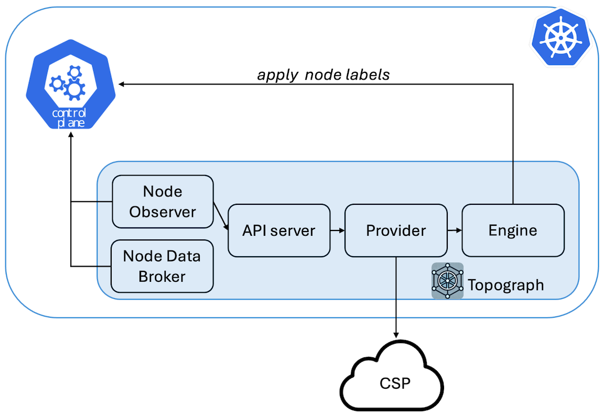

# Topograph in Kubernetes

Topograph is a tool designed to enhance scheduling decisions in Kubernetes clusters by leveraging network topology information.

## Overview

Topograph maps both the multi-tier network hierarchy and accelerated network domains (such as NVLink) using node labels.
Most cloud providers expose three levels of network topology through their APIs. To provide a unified view, Topograph assigns four labels to each node:
* `network.topology.nvidia.com/accelerator`: Identifies high-speed interconnect domains, such as NVLink.
* `network.topology.nvidia.com/block`: Indicates the switches directly connected to compute nodes.
* `network.topology.nvidia.com/spine`: Represents the next tier of switches above the block level.
* `network.topology.nvidia.com/datacenter`: Denotes the top-level switches.

The names of these node labels are configurable via the [Helm chart](https://github.com/NVIDIA/topograph/tree/main/charts/topograph).

For example, if a node belongs to NVLink domain `nvl1` and connects to switch `s1`, which connects to switch `s2`, and then to switch `s3`, Topograph will apply the following labels to the node:

```
  network.topology.nvidia.com/accelerator: nvl1
  network.topology.nvidia.com/block: s1
  network.topology.nvidia.com/spine: s2
  network.topology.nvidia.com/datacenter: s3
```

<p align="center"></p>

## Use of Topograph

While there is currently no fully network-aware scheduler capable of optimally placing groups of pods based on network considerations, Topograph serves as a stepping stone toward developing such a scheduler.

Topograph can be used in conjunction with Kubernetes' existing PodAffinity feature.
This combination enhances pod distribution based on network topology information.

The following excerpt describes a Kubernetes object specification for a cluster with a three-tier network switch hierarchy. The goal is to improve inter-pod communication by assigning pods to nodes within
closer network proximity.

```yaml
    affinity:
      podAffinity:
        preferredDuringSchedulingIgnoredDuringExecution:
          - weight: 70
            podAffinityTerm:
              labelSelector:
                matchExpressions:
                  - key: app
                    operator: In
                    values:
                      - myapp
              topologyKey: network.topology.nvidia.com/spine
          - weight: 90
            podAffinityTerm:
              labelSelector:
                matchExpressions:
                  - key: app
                    operator: In
                    values:
                      - myapp
              topologyKey: network.topology.nvidia.com/block
```
Pods are prioritized to be placed on nodes sharing the label `network.topology.nvidia.com/block`.
These nodes are connected to the same network switch, ensuring the lowest latency for communication.

Nodes with the label `network.topology.nvidia.com/spine` are next in priority.
Pods on these nodes will still be relatively close, but with slightly higher latency.

In the three-tier network, all nodes will share the same `network.topology.nvidia.com/datacenter` label,
so it doesn’t need to be included in pod affinity settings.

Since the default Kubernetes scheduler places one pod at a time, the placement may vary depending on where
the first pod is placed. As a result, each scheduling decision might not be globally optimal.
However, by aligning pod placement with network-aware labels, we can significantly improve inter-pod
communication efficiency within the limitations of the scheduler.

## Configuration
Topograph is deployed as a standard Kubernetes application using a [Helm chart](https://github.com/NVIDIA/topograph/tree/main/charts/topograph).
Topograph is configured using a configuration file stored in a ConfigMap and mounted to the Topograph container at `/etc/topograph/topograph-config.yaml`.
In addition, when sending a topology request, the request payload includes additional parameters.
The parameters for the configuration file and topology request are defined in the `global` section of the Helm values file, as shown below:

```yaml
global:
  # provider – name of the cloud provider or on-prem environment.
  # Supported values: "aws", "gcp", "oci", "nebius", "baremetal.ib".
  provider: "aws"

  engine: "k8s"
```


## Validation and Testing
TBD
