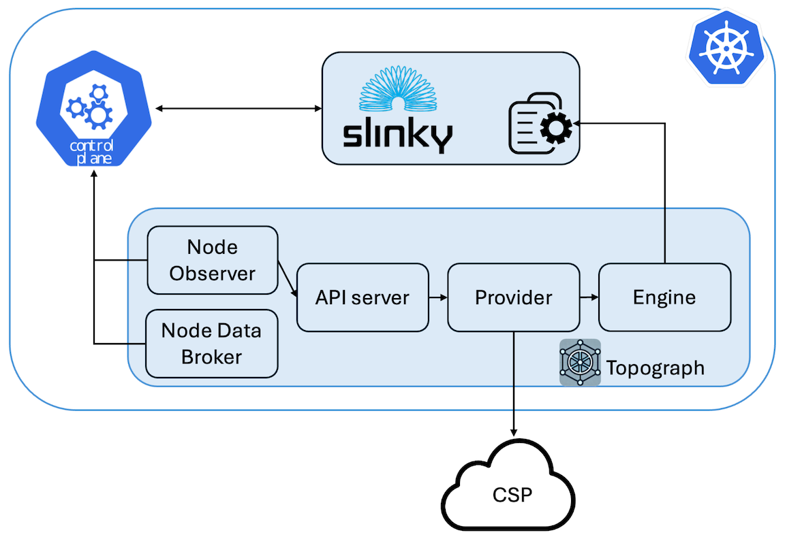

# Topograph Slinky Engine

## Overview

The **slinky engine** is Topograph's engine for SLURM clusters running on Kubernetes. It is designed to work with the [Slinky project](https://github.com/SlinkyProject/) - an open-source set of integration tools by SchedMD that brings SLURM capabilities into Kubernetes environments.

While the [Slinky project](https://slinky.ai) provides comprehensive SLURM-on-Kubernetes orchestration (operators, schedulers, exporters, etc.), Topograph's slinky engine complements this ecosystem by providing **topology discovery and configuration management** for SLURM clusters running in Kubernetes.

The Slinky engine bridges the gap between Kubernetes infrastructure and SLURM workload management by updating SLURM topology configurations stored in Kubernetes ConfigMaps.

## How It Works

1. **Node Discovery**: Queries Kubernetes nodes and SLURM pods to build a topology map
2. **Topology Generation**: Creates SLURM topology configuration (tree or block format)
3. **ConfigMap Management**: Updates the specified ConfigMap with new topology data including metadata annotations for tracking and debugging

<p align="center"></p>

## Configuration
Topograph is deployed as a standard Kubernetes application using a [Helm chart](https://github.com/NVIDIA/topograph/tree/main/charts/topograph).
Topograph is configured using a configuration file stored in a ConfigMap and mounted to the Topograph container at `/etc/topograph/topograph-config.yaml`.
In addition, when sending a topology request, the request payload includes additional parameters.
The parameters for the configuration file and topology request are defined in the `global` section of the Helm values file, as shown below:

```yaml
global:
  # provider – name of the cloud provider or on-prem environment.
  # Supported values: "aws", "gcp", "oci", "nebius", "netq", "baremetal.ib".
  provider: aws
  engine: slinky
  engineParams:
    namespace: ns-slinky                               # Namespace where Slinky is running
    podSelector:                                      # Label selector for pods running SLURM nodes
      matchLabels:
        app.kubernetes.io/component: compute
    plugin: topology/block                             # Name of the topology plugin
    block_sizes: 4                                     # (Optional) Block size for the block topology plugin
    topologyConfigmapName: slurm-config              # Name of the ConfigMap containing the topology config
    topologyConfigPath: topology.conf                # Key in the ConfigMap for the topology config
```

## ConfigMap Annotations

Slinky automatically adds metadata annotations to managed ConfigMaps for improved observability:

```yaml
apiVersion: v1
kind: ConfigMap
metadata:
  name: slurm-config
  annotations:
    # Topograph metadata
    topograph.nvidia.com/engine: "slinky"
    topograph.nvidia.com/topology-managed-by: "topograph"
    topograph.nvidia.com/last-updated: "2024-01-01T10:11:00Z"
    topograph.nvidia.com/slurm-namespace: "slurm"
    topograph.nvidia.com/plugin: "topology/tree"
    topograph.nvidia.com/block-sizes: "8,16,32"

    # Original annotations preserved
    meta.helm.sh/release-name: slurm
    meta.helm.sh/release-namespace: slurm
data:
  topology.conf: |
    SwitchName=sw1 Switches=sw[2-3]
    SwitchName=sw2 Nodes=node[1-4]
    SwitchName=sw3 Nodes=node[5-8]
```

### Annotation Reference

| Annotation                                 | Description                               |
| ------------------------------------------ | ----------------------------------------- |
| `topograph.nvidia.com/engine`              | Engine that manages this ConfigMap        |
| `topograph.nvidia.com/topology-managed-by` | Indicates topograph manages topology data |
| `topograph.nvidia.com/last-updated`        | RFC3339 timestamp of last update          |
| `topograph.nvidia.com/slurm-namespace`     | SLURM cluster namespace                   |
| `topograph.nvidia.com/plugin`              | Topology plugin used (tree/block)         |
| `topograph.nvidia.com/block-sizes`         | Block sizes for block topology            |

## Usage Examples

Topograph runs autonomously in Kubernetes environments, including Slinky. When the Node Observer detects that a node has been added or removed, it sends topology requests to the Topograph API server, which then triggers an update to the network topology information within the cluster. However, if you want to manually trigger network topology discovery, you can send HTTP requests to the API server, as shown below.

### Topology Configuration in the Tree Format

```bash
curl -X POST -H "Content-Type: application/json" \
  -d '{
    "provider": {"name": "aws"},
    "engine": {
      "name": "slinky",
      "params": {
        "namespace": "ns-slinky",
        "podSelector": {
          "matchLabels": {
            "app.kubernetes.io/component": "compute"
          }
        },
        "topologyConfigPath": "topology.conf",
        "topologyConfigmapName": "slurm-config"
      }
    }
  }' \
  http://localhost:49021/v1/generate
```

### Topology Configuration in the Block Format

```bash
curl -X POST -H "Content-Type: application/json" \
  -d '{
    "provider": {"name": "aws"},
    "engine": {
      "name": "slinky",
      "params": {
        "namespace": "ns-slinky",
        "podSelector": {
          "matchLabels": {
            "app.kubernetes.io/component": "compute"
          }
        },
        "topologyConfigPath": "topology.conf",
        "topologyConfigmapName": "slurm-config",
        "plugin": "topology/block",
        "block_sizes": "8,16,32"
      }
    }
  }' \
  http://localhost:49021/v1/generate
```
